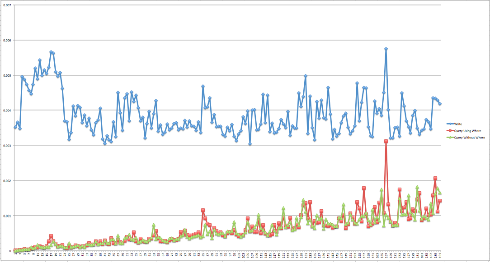
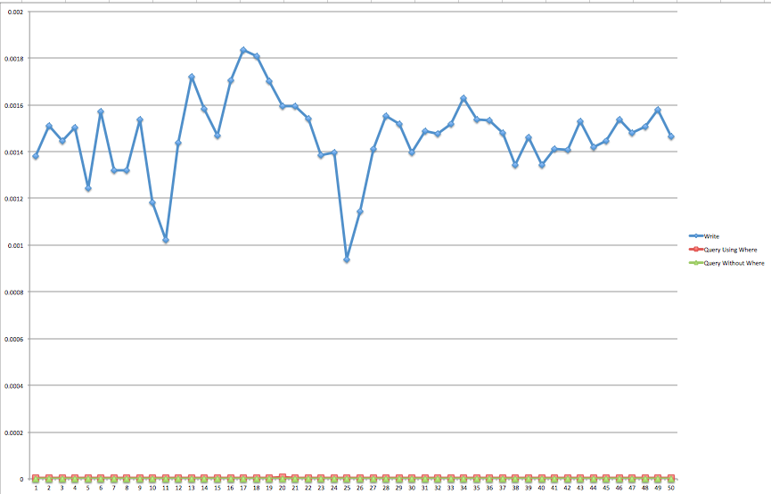

Benchmark DB  

## Introduction 

i created this simple repo to test performance for comparing postgreDB, mysql & cockroachDB


## Getting started

### Pre Requirements
1. mysql, postgrelsql & cockroachDB installed in your local machine
2. golang v1.8 or latest
3. db & table created before running this benchmark app

for cockroachDB
```
create database products;
create table products.product_shippings(id SERIAL, shop_id INT , shipping_ids string);
```

for postgreSQL
```
CREATE TABLE "product_shippings" (
  "id" serial NOT NULL,
  "shop_id" integer NOT NULL DEFAULT '0',
  "shipping_ids" character varying(150) NOT NULL
);
```

for mysql 
```
CREATE TABLE `product_shippings` (
  `id` int NOT NULL AUTO_INCREMENT PRIMARY KEY,
  `shop_id` int NOT NULL,
  `shipping_ids` varchar(150) NOT NULL
);
```

### Run

```
$ git clone <git-repo-url>
$ cd benchmarkdb
$ go build
$ ./kecoadb
    set iteration n to 1000
    test write done in 0.003378 second
    test read using where done in 0.000534 second
    test read without where condition done in 0.000459 second

```
### Output Benchmark Result
output file is located at result.csv

### Result 

cockroachDB benchmark result

<br><br>
Average write: 0.003860905	
Average read using where query: 0.000604311	
Average read without where query: 0.000570346

postgreSQL benchmark result

<br><br>
Average write: 0.003860905	
Average read using where query: 0.000604311	
Average read without where query: 0.000570346

mysql benchmark result

<br><br>
Average write: 0.003860905	
Average read using where query: 0.000604311	
Average read without where query: 0.000570346


